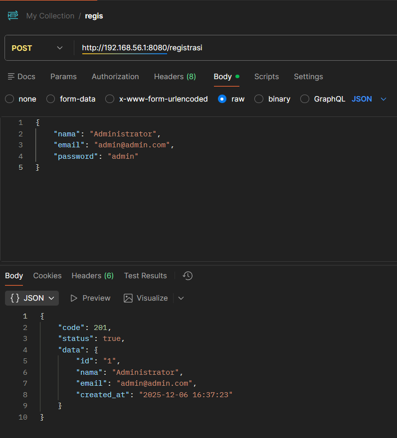
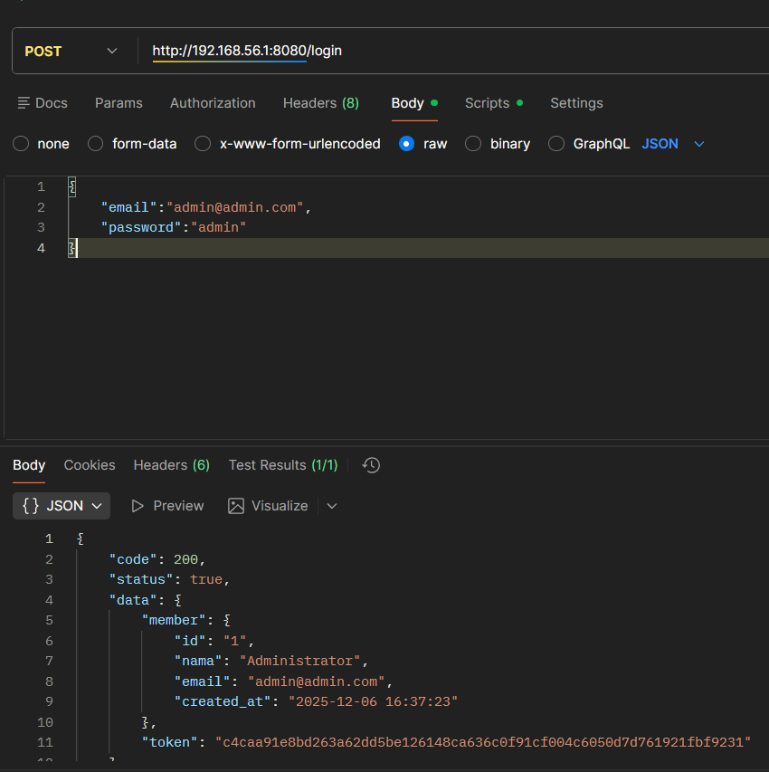
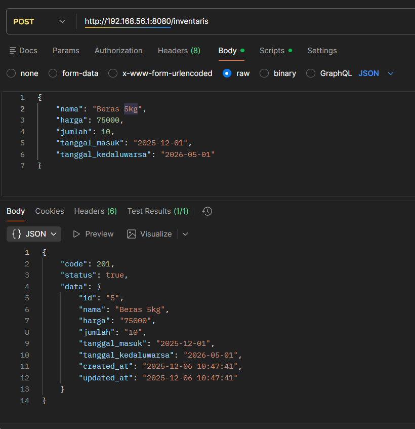
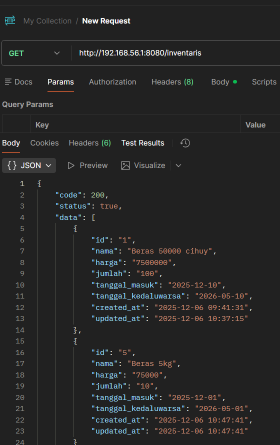
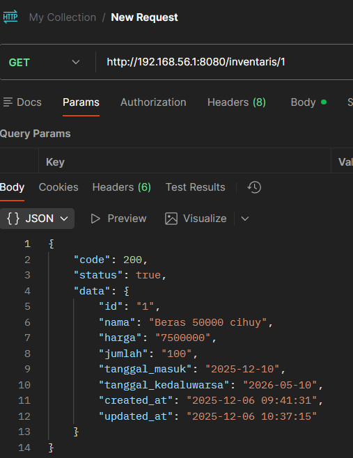
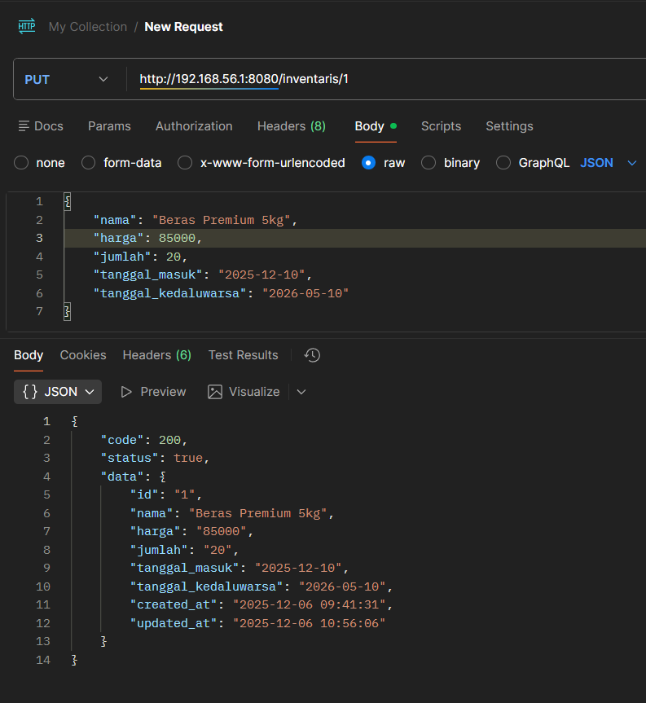
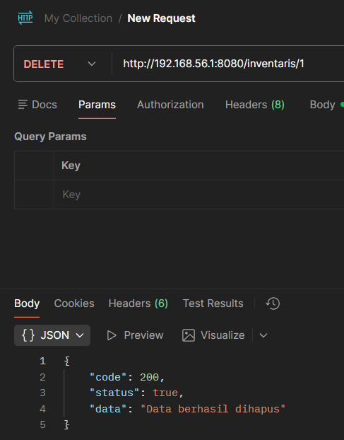

# Responsi 2 Mobile Paket 2 H1D023109 — Inventaris Cihuy Yosa

## Identitas Mahasiswa
- **Nama** : Yosafat Bagus Birawa  
- **NIM**  : H1D023109  
- **Shift Baru** : D  
- **Shift Asal** : D  

## Video Demo Aplikasi

https://github.com/user-attachments/assets/a5e3546b-0115-426f-8242-2a1b9a9861b6

## Spesifikasi API (Backend CodeIgniter 4)

### Base URL
```

http://192.168.56.1:8080

````

Gunakan IP LAN seperti `192.168.56.1:8080` untuk Flutter Web  

## API: REGISTRASI  



## API: LOGIN



## API: CREATE INVENTARIS



## API: LIST INVENTARIS



## 📝 API: DETAIL



## ✏️ API: UPDATE



## 🗑️ API: DELETE



## Struktur Database (MySQL)

```sql
CREATE DATABASE IF NOT EXISTS responsi2_api;
USE responsi2_api;

CREATE TABLE member (
  id INT AUTO_INCREMENT PRIMARY KEY,
  nama VARCHAR(255),
  email VARCHAR(255) UNIQUE,
  password VARCHAR(255),
  created_at TIMESTAMP DEFAULT CURRENT_TIMESTAMP
);

CREATE TABLE member_token (
  id INT AUTO_INCREMENT PRIMARY KEY,
  member_id INT NOT NULL,
  auth_key VARCHAR(255) NOT NULL,
  created_at TIMESTAMP DEFAULT CURRENT_TIMESTAMP
);

CREATE TABLE inventaris (
  id INT AUTO_INCREMENT PRIMARY KEY,
  nama VARCHAR(255),
  harga INT,
  jumlah INT,
  tanggal_masuk VARCHAR(50),
  tanggal_kedaluwarsa VARCHAR(50),
  created_at TIMESTAMP DEFAULT CURRENT_TIMESTAMP,
  updated_at TIMESTAMP NULL ON UPDATE CURRENT_TIMESTAMP
);
```

## Penjelasan Kode (Backend)

### `RegistrasiController::registrasi()`

* Menerima nama, email, password
* Validasi input
* Password di-hash
* Insert ke tabel `member`
* Return JSON `{code,status,data}`

### `LoginController::login()`

* Menerima email & password
* Cek akun & `password_verify`
* Generate token
* Insert ke tabel `member_token`
* Return JSON dengan token

### `InventarisController`

* `create()` → tambah inventaris
* `list()` → tampil semua
* `detail($id)` → ambil 1 data
* `ubah($id)` → update inventaris
* `hapus($id)` → delete inventaris

## Penjelasan Kode (Frontend Flutter)

### `api_service.dart`

* Mengirim request `GET/POST/PUT/DELETE`
* Menyimpan token (optional)
* Mengatur `baseUrl` API

### `login_page.dart`

* Form login
* Jika sukses → masuk ke `InventarisListPage`

### `register_page.dart`

* Form registrasi
* Jika sukses → kembali ke login

### `inventaris_list_page.dart`

* Menampilkan daftar inventaris
* Tombol FAB untuk tambah
* PopupMenu Edit & Delete

### `inventaris_form_page.dart`

* Form Tambah/Edit inventaris
* Validasi form
* Mengirim POST / PUT ke API
